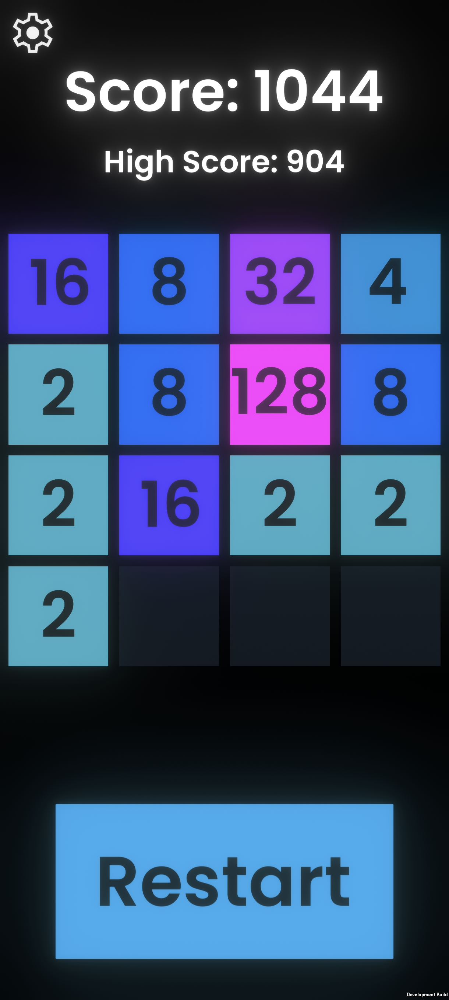
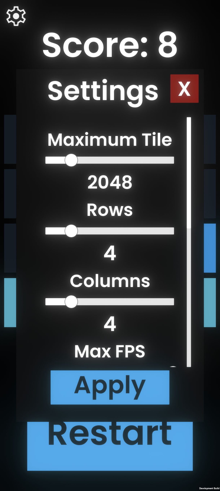

# 📱 Next Gen 2048

**Next Gen 2048** - это современное, плавное и глубоко кастомизируемое переосмысление культовой головоломки 2048, разработанное на движке Unity. Игра создана с акцентом на высокую производительность (поддержка 120 FPS), сочный аудиодизайн и свободу игрока в настройке игрового поля.

---

### 📸 Скриншоты / Screenshots

| Главный экран и геймплей | Меню глубоких настроек |
|:---:|:---:|
 |  |

---

### ✨ Ключевые особенности / Features

*   **⚡ Next-Gen Плавность:** Полная оптимизация под современные устройства, поддержка **120 FPS** и экранов с высокой частотой обновления.
*   **🛠️ Полная песочница (Custom Grid):** Настраивай игровое поле под себя! Изменяй количество строк и столбцов (от классики до хардкорных **8x8**).
*   **🎨 Умное масштабирование:** Уникальная математическая система автоматического пересчета размеров 2D-спрайтов под любой выбранный размер сетки без выхода за границы экрана.
*   **🏃 Скорость под контролем:** Возможность регулировать скорость анимации плиток (идеально для спидраннеров).
*   **🎵 Сочный аудиодизайн (Juiciness):** 
    *   Адаптивный `Pitch` звука: чем больше номинал получившейся плитки, тем выше и триумфальней звучит эффект слияния!
    *   6 разнообразных Pop-эффектов, чтобы уши не уставали от монотонности.
    *   Раздельные ползунки громкости (Master, SFX, Music) через Unity AudioMixer.
*   **💾 Надежные сохранения:** Продвинутая система локальных сохранений рекордов через **JSON** (подготовлено для будущей интеграции с облаком Google Play Games). Настройки кастомизации бережно хранятся в `PlayerPrefs`.
*   **🔄 Плавный интерфейс:** Все меню и всплывающие панели анимированы с использованием библиотеки **DOTween**.

---

### 🛠️ Технологический стек / Tech Stack

*   **Движок:** Unity (C#)
*   **Система ввода:** Unity New Input System (обработка свайпов на мобильных и стрелочек на ПК)
*   **Анимации:** DOTween
*   **Архитектура ввода/вывода:** JSON Serialization & PlayerPrefs
*   **Графика:** Кастомные 2D-спрайты (Мировое пространство / World Space)

---

### 📜 Лицензия и Благодарности / Credits

*   **Базовая механика:** Проект разработан на основе открытого исходного кода Unity-порта 2018 года под лицензией **MIT**. Логика полностью переработана, рефакторирована и адаптирована под современные стандарты Unity. (https://github.com/dgkanatsios/2048)
*   **Шрифт:** [Poppins](https://fonts.google.com/specimen/Poppins) от Google Fonts (распространяется по лицензии SIL Open Font License).
